# Harokopio University of Athens, Informatics and Telematics Department

## Operating Systems (3<sup>rd</sup> Semester)
(Winter Semester 2025-2026)

---

## Operating Systems Lab Project – Analyzing and Processing System Events in UNIX Environment

---

## I. Environment Preparation & Basic Commands
1. `monitor` directory with `/raw`, `/processed` & `/reports` subdirectories creation:
```bash
mkdir -p monitor/{raw,processed,reports}
```


2. `system.log`, `network.log` & `security.log` files creation in the `/monitor/raw` directory:
```bash
touch monitor/raw/system.log monitor/raw/network.log monitor/raw/security.log
```

3. Redirect and append (`>>`) the following strings ([FreeBSD](https://www.freebsd.org/)-based mock logs), that contain: YYYY-MM-DD pattern, "ERROR", "FAILED", "CRITICAL" & IPv4 address

For `monitor/raw/system.log`:
```
"2025-10-25 08:00:15 freebsd-srv kernel: Copyright (c) 1992-2025 The FreeBSD Project."
"2025-10-25 08:00:18 freebsd-srv kernel: CRITICAL event: da0: READ_DMA failure - Check cables."
"2025-10-25 12:30:05 freebsd-srv cron[1055]: (root) CMD (/usr/libexec/atrun)"
"2025-10-26 09:15:00 freebsd-srv syslogd: kernel boot file is /boot/kernel/kernel"
"INFO: User logged in from 192.168.1.15 via sshd[22]"
```
For `monitor/raw/network.log`:
```
"2025-10-25 14:20:00 freebsd-srv sshd[8022]: Accepted publickey for admin from 192.168.1.20 port 55122 ssh2"
"FAILED: Connection timed out to 10.0.0.5 during pkg update"
"2025-10-26 03:00:11 freebsd-srv ipfw: 100 Deny TCP 192.168.1.20:5342 192.168.1.1:80 in via em0"
"ERROR: Network unreachable: route to 8.8.8.8 is down via interface em0"
"2025-10-26 15:45:22 freebsd-srv named[662]: client @0x802345678 192.168.1.45#4321: query: google.com IN A + (192.168.1.1)"
```
For `monitor/raw/system.log`:
```
"2025-10-25 10:00:01 freebsd-srv su: admin to root on /dev/pts/0"
"WARNING: Failed login attempt from 192.168.1.100 user=root"
"CRITICAL: Firewall breach detected on port 22 (Brute Force)"
"2025-10-26 18:20:55 freebsd-srv sudo: admin : TTY=pts/1 ; PWD=/home/admin ; USER=root ; COMMAND=/usr/sbin/service apache24 restart"
"2025-10-26 18:21:05 freebsd-srv kernel: pid 4321 (apache24), jid 0, uid 0: exited on signal 11 (core dumped)”
```
```bash
(
echo "2025-10-25 08:00:15 freebsd-srv kernel: Copyright (c) 1992-2025 The FreeBSD Project."
echo "2025-10-25 08:00:18 freebsd-srv kernel: CRITICAL event: da0: READ_DMA failure - Check cables."
echo "2025-10-25 12:30:05 freebsd-srv cron[1055]: (root) CMD (/usr/libexec/atrun)"
echo "2025-10-26 09:15:00 freebsd-srv syslogd: kernel boot file is /boot/kernel/kernel"
echo "INFO: User logged in from 192.168.1.15 via sshd[22]"
) >> monitor/raw/system.log
```
```bash
(
echo "2025-10-25 14:20:00 freebsd-srv sshd[8022]: Accepted publickey for admin from 192.168.1.20 port 55122 ssh2"
echo "FAILED: Connection timed out to 10.0.0.5 during pkg update"
echo "2025-10-26 03:00:11 freebsd-srv ipfw: 100 Deny TCP 192.168.1.20:5342 192.168.1.1:80 in via em0"
echo "ERROR: Network unreachable: route to 8.8.8.8 is down via interface em0"
echo "2025-10-26 15:45:22 freebsd-srv named[662]: client @0x802345678 192.168.1.45#4321: query: google.com IN A + (192.168.1.1)"
) >> monitor/raw/network.log
```
```bash
(
echo "2025-10-25 10:00:01 freebsd-srv su: admin to root on /dev/pts/0"
echo "WARNING: Failed login attempt from 192.168.1.100 user=root"
echo "CRITICAL: Firewall breach detected on port 22 (Brute Force)"
echo "2025-10-26 18:20:55 freebsd-srv sudo: admin : TTY=pts/1 ; PWD=/home/admin ; USER=root ; COMMAND=/usr/sbin/service apache24 restart"
echo "2025-10-26 18:21:05 freebsd-srv kernel: pid 4321 (apache24), jid 0, uid 0: exited on signal 11 (core dumped)"
) >> monitor/raw/security.log
```


4. Display a detailed list of each line with [`ls`](https://man.freebsd.org/cgi/man.cgi?ls) (standing for "list") and the "line" flag `-l`:
```bash
ls -l monitor/raw/
```
and use [`wc`](https://man.freebsd.org/cgi/man.cgi?wc) (standing for "word count") with the "line" flag `-l` to count total lines in the 3 `.log` files:
```bash
wc -l monitor/raw/*.log
```


---

## II. Filtering logs with Regular Expressions
1. Use of [`grep`](https://man.freebsd.org/cgi/man.cgi?grep) with extended regex (`-E`) to locate lines starting with YYYY-MM-DD pattern, lines containing "ERROR", "FAILED", "CRITICAL" & IPv4 address:
```bash
grep -E "^[0-9]{4}-[0-9]{2}-[0-9]{2}|ERROR|FAILED|CRITICAL|([0-9]{1,3}\.){3}[0-9]{1,3}" monitor/raw/*.log
```

2. Redirect and overwrite (`>`) [`grep`](https://man.freebsd.org/cgi/man.cgi?grep) result in `monitor/processed/alerts.raw`:
```bash
grep -E "^[0-9]{4}-[0-9]{2}-[0-9]{2}|ERROR|FAILED|CRITICAL|([0-9]{1,3}\.){3}[0-9]{1,3}" monitor/raw/*.log > monitor/processed/alerts.raw
```

3. Remove duplicate lines with [`uniq`](https://man.freebsd.org/cgi/man.cgi?uniq) and [`sort`](https://man.freebsd.org/cgi/man.cgi?sort) them, creating the `monitor/processed/alerts.sorted` file with pipe (`|`) and redirect & overwrite (`>`):
```bash
sort monitor/processed/alerts.raw | uniq > monitor/processed/alerts.sorted
```


---

## III. Combining Pipes & Redirection to create a report
1. [`cat`](https://man.freebsd.org/cgi/man.cgi?cat) redirects `monitor/processed/alerts.sorted`'s contents via pipe (`|`) to [`awk`](https://man.freebsd.org/cgi/man.cgi?awk) which is executed separately for each of the file's lines, allowing us to define local variables (counters) and print the output:
```bash
cat monitor/processed/alerts.sorted | awk '{
    # Increase total alert counter for every line read
    count++; 

    # If the line contains "ERROR", increase error counter
    if ($0 ~ /ERROR/) error++; 

    # If the line contains a local IP (192.168.*), increase ip counter
    if ($0 ~ /192\.168\./) ip++; 
} 
END { 
    # Print final summary
    print "Total Alerts: " count ", Errors: " error ", Local Network Events: " ip 
}'
```

2. Redirect and overwrite (`>`) the output of the [`cat`](https://man.freebsd.org/cgi/man.cgi?cat) pipe (`|`) with [`awk`](https://man.freebsd.org/cgi/man.cgi?awk) in the `monitor/reports/daily_summary.txt` file with:
```bash
cat monitor/processed/alerts.sorted | awk '{
    # Increase total alert counter for every line read
    count++; 

    # If the line contains "ERROR", increase error counter
    if ($0 ~ /ERROR/) error++; 

    # If the line contains a local IP (192.168.*), increase ip counter
    if ($0 ~ /192\.168\./) ip++; 
} 
END { 
    # Print final summary
    print "Total Alerts: " count ", Errors: " error ", Local Network Events: " ip 
}' > monitor/reports/daily_summary.txt
```


---

## IV. Process Management
1. Run background process (`&`) that records timestamps every 2 seconds ([`sleep`](https://man.freebsd.org/cgi/man.cgi?sleep) `2`) via a while loop in the `monitor/raw/timestamps.log` file with:
```bash
(while true; do date >> monitor/raw/timestamps.log; sleep 2; done) &
```
2. Identification of the process' ID (PID) that runs in the background (`&`), using [`ps`](https://man.freebsd.org/cgi/man.cgi?ps) for viewing processes (with the "every" flag `-e`, to show every system process (user-independent) and with the "full format" flag `-f`, to show additional information for every process)) and [`grep`](https://man.freebsd.org/cgi/man.cgi?grep) for filtering with:
```bash
ps -ef | grep sleep
```

3. Use of [`renice`](https://man.freebsd.org/cgi/man.cgi?renice) to the process whose `PID = 931`, to change the process' priority (niceness) to `10` (lowest process) (sudo privileges required) with:
```bash
sudo renice -n 10 -p 931
```

4. Process termination with `-TERM` (`SIGTERM`) [signal](https://man.freebsd.org/cgi/man.cgi?query=signal) via [`kill`](https://man.freebsd.org/cgi/man.cgi?kill) to the process whose `PID = 931` with:
```bash
kill -TERM 931
```

5. The process was found running with `PID = 931`. Initially, its priority was reduced with [`renice`](https://man.freebsd.org/cgi/man.cgi?renice) and then the process was permanently terminated via [`kill`](https://man.freebsd.org/cgi/man.cgi?kill). The `monitor/raw/timestamps.log` file confirms that logging stopped after the process was terminated.
```bash
cat monitor/raw/timestamps.log
```


---

## V. Implementing a C program for analyzing logs
1. Receive `.log` file's name as an argument and check if not received.
```c
int main(int argc, char *argv[]) {
    // Check if filename argument is provided
    if (argc != 2) {
        fprintf(stderr, "%sUsage: %s <filename>%s\n", YELLOW, argv[0], NC);
        return 1;   // Error opening -> exit code 1
    }
}
```
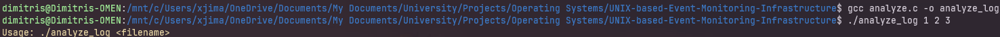
2. Attempt to [`open()`](https://man.freebsd.org/cgi/man.cgi?open) the file via system call with the "open for reading only" flag `O_RDONLY` and returning [`open()`](https://man.freebsd.org/cgi/man.cgi?open)'s value to an integer holding the file descriptor's ID.
```c
// Open file using system call (with reading only flag)
int fd = open(argv[1], O_RDONLY);   // File descriptor
```
3. If [`open()`](https://man.freebsd.org/cgi/man.cgi?open) returns `-1`, the file failed to open and [`perror()`](https://man.freebsd.org/cgi/man.cgi?perror) is used to print an error message.
```c
// Check for open() error
if (fd == -1) {
    perror(RED "Error opening file");
    return 1;   // Error opening -> exit code 1
}
```
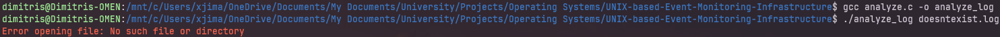
4. If the file opens, [`getline()`](https://man.freebsd.org/cgi/man.cgi?getline) reads, inside an infinite loop, each of the `fp`'s (file pointer's) line until it returns `-1`, meaning the end of file (`EOF`). The variables that are defined are:
- total lines read from the use of [`getline()`](https://man.freebsd.org/cgi/man.cgi?getline) counter
- "ERROR" string-containing lines from the use of [`strstr()`](https://man.freebsd.org/cgi/man.cgi?strstr) counter
- digit-containing lines from the use of [`isdigit`](https://man.freebsd.org/cgi/man.cgi?isdigit) in a loop counter
```c
char *ln = NULL;    // Line's text
size_t len = 0;     // Buffer allocation size
ssize_t read;       // Characters read counter

size_t sumln = 0;  // Lines read counter
size_t errln = 0;  // "ERROR"-containing lines counter
size_t noln = 0;   // Digit-containing lines counter

// Read file line-by-line
while ((read = getline(&ln, &len, fp)) != -1) {
    sumln++;    // Increment line counter

    // Increment "ERROR"-containing line counter
    if (strstr(ln, "ERROR") != NULL) {
        errln++;
    }

    // Increment digit-containing line counter
    for (int i = 0; i < read; i++) {
        if (isdigit(ln[i])) {
            noln++;
            break;  // Stop checking the line if a number is found
        }
    }
}
```
5. If the file is successfully read, [`main()`](https://man.freebsd.org/cgi/man.cgi?main) returns exit code `0` and prints statistics:
```c
// Print statistics
printf("File: %s | Lines: %zu | Errors: %zu | Numeric Lines: %zu\n", argv[1], sumln, errln, noln);

return 0;   // Success -> exit code 0
```
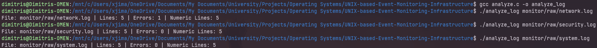
Else if an opening file error exists, [`main()`](https://man.freebsd.org/cgi/man.cgi?main) returns exit code `1` :
```c
// Check if filename argument is provided
if (argc != 2) {
    fprintf(stderr, "%sUsage: %s <filename>%s\n", YELLOW, argv[0], NC);
    return 1;   // Error opening -> exit code 1
}

// Check for open() error
if (fd == -1) {
    perror(RED "Error opening file");
    return 1;   // Error opening -> exit code 1
}
       
// Convert file descriptor to stream for getline() w/ read permission
FILE *fp = fdopen(fd, "r");     // File pointer
if (fp == NULL) {
    perror(RED "Error converting file descriptor");
    close(fd);  // Close file
    return 1;   // Error converting -> exit code 1
}
```
and exit code `2` if a file is empty:
```c 
// Empty file -> exit code 2
if (sumln == 0) {
    fprintf(stderr, "%sEmpty file warning: %s%s\n", YELLOW, argv[1], NC);
    return 2;
}
```
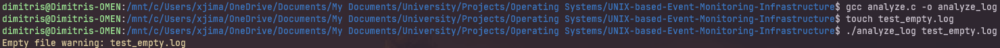

Finally, with the use of [`gcc`](https://gcc.gnu.org/) and the output flag `-o`, we compile `analyze.c` into the executable `analyze_log` with:
```bash
gcc analyze.c -o analyze_log
```


*Note: <span style="color:red"> *Colored strings*</span> have been added to error outputs.*

---

## VI. Shell Script that automates the entire system
1. Pass a logs' directory as an argument:
```bash
# Assign first argument to variable
LOG_D=$1
```
2. Check if an argument was passed (positional parameters) by checking if total arguments number `$#` is not equal `-ne` to `1`. If `true`, then print an [`echo`](https://man.freebsd.org/cgi/man.cgi?echo) message and [`exit`](https://man.freebsd.org/cgi/man.cgi?exit) with exit code `1`.
```bash
# Check if more than one argument is being passed
if [ "$#" -ne 1 ]; then
    echo -e "${YELLOW}USAGE: bash $0 /path/to/logs/${NC}"
    exit 1
fi
```
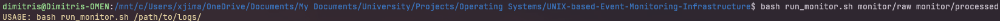
3. Check if the passed `$LOG_D` argument is NOT `!` a directory `-d` (therefore, checking if it also exists) and if `true` then [`echo`](https://man.freebsd.org/cgi/man.cgi?echo) an error message and [`exit`](https://man.freebsd.org/cgi/man.cgi?exit) with exit code `1`.
```bash
# Check if path exists & is NOT a directory
if [ ! -d "$LOG_D" ]; then
    echo -e "${RED}ERROR: Directory '$LOG_D' does not exist.${NC}"
    exit 1
fi
```
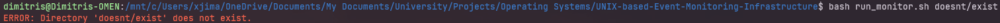
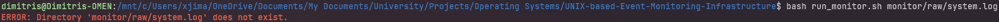
4. Display with [`echo`](https://man.freebsd.org/cgi/man.cgi?echo) the name of the script `$0` and the total number of arguments `$#` and inform user about abortion signal ("signal interrupted" `SIGINT` signal (^C)):
```bash
# Script info
echo -e "${GREEN}SCRIPT: $0 running with $# argument${NC}\n"
echo "Starting continuous monitoring..."
echo -e "${RED}(Exit with: ^C)${NC}\n"
```
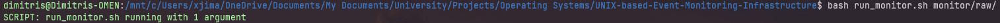
5. Check if the executable exists and is executable with `-x`, then call the `$ANALYZER_EXEC="./analyze_log"` program for each file in the directory as a `$file` argument. Else, if the executable is missing, [`echo`](https://man.freebsd.org/cgi/man.cgi?echo) an error message and [`exit`](https://man.freebsd.org/cgi/man.cgi?exit) with exit code `1`.
```bash
ANALYZER_EXEC="./analyze_log"

        # Check if executable exists and is executable
        if [ -x "$ANALYZER_EXEC" ]; then
            # Run executable w/ the file as argument & append its output to report file
            "$ANALYZER_EXEC" "$file" >> "$RPT_F"
            # Exit code cases
        else
            # Exit if executable missing
            echo -e "${RED}ERROR: '$ANALYZER_EXEC' not found!${NC}"
            exit 1
        fi
```
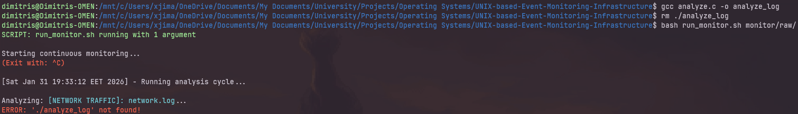
6. Define a report file variable `$RPT_F` holding the string value of its path `monitor/reports/full_report.txt`.
```bash
# Report file path
RPT_F="monitor/reports/full_report.txt"
```
Then, initialize/overwrite (`>`) the file with [`echo`](https://man.freebsd.org/cgi/man.cgi?echo)-ing a header.
```bash
# Initialize (overwrite) report file
echo "-------------------------- SYSTEM MONITOR FULL REPORT --------------------------" > "$RPT_F"
```
After that, [`echo`](https://man.freebsd.org/cgi/man.cgi?echo) the `$(date)` when the script is run and append (`>>`) it to the report file `$RPT_F`.
```bash
echo "Run @ $(date)" >> "$RPT_F"
echo "--------------------------------------------------------------------------------" >> "$RPT_F"
```
Then again, [`echo`](https://man.freebsd.org/cgi/man.cgi?echo) the `CATEGORY` and the `$filename` of the `$file` and append (`>>`) it to the report file `$RPT_F`.
```bash
# Append separator and file header to report
echo "" >> "$RPT_F"
echo "===================== $CATEGORY: $filename =====================" >> "$RPT_F"
```
And finally, run the `$ANALYZER_EXEC="./analyze_log"` executable with the `$file` argument and append (`>>`) its output ([`stdout`](https://man.freebsd.org/cgi/man.cgi?stdout)) to the report file `$RPT_F`.
```bash
# Run executable w/ the file as argument & append its output to report file
"$ANALYZER_EXEC" "$file" >> "$RPT_F" 
```
However, if the `$ANALYZER_EXEC="./analyze_log"` executable's `$EXIT_CODE` is not equal `-ne` to `0` then we append (`>>`) each case's error to the report file `$RPT_F`:
```bash
# Store exit code
EXIT_CODE=$?

# Check execution status
if [ $EXIT_CODE -ne 0 ]; then
    # Exit code cases
else
    # Success Message (Exit Code 0)
    echo -e "${GREEN}   -> Analyzed successfully.${NC}"
fi
```
- If `$EXIT_CODE` is equal `-eq` to 1 then append (`>>`) the [`echo`](https://man.freebsd.org/cgi/man.cgi?echo)'s output to the report file `$RPT_F` and [`echo`](https://man.freebsd.org/cgi/man.cgi?echo) that the `$file` failed to open.
```bash
# Exit code 1 -> Error opening
if [ $EXIT_CODE -eq 1 ]; then
    echo "   [X] ERROR: Cannot open file." >> "$RPT_F"
    echo -e "${RED}   -> Cannot open file (Exit code 1)${NC}"
```
- If `$EXIT_CODE` is equal `-eq` to 2 then append (`>>`) the [`echo`](https://man.freebsd.org/cgi/man.cgi?echo)'s output to the report file `$RPT_F` and [`echo`](https://man.freebsd.org/cgi/man.cgi?echo) that the `$file` is empty.
```bash
# Exit code 2 -> Empty file
elif [ $EXIT_CODE -eq 2 ]; then
      echo "   [!] NOTE: File is empty." >> "$RPT_F"
      echo -e "${YELLOW}   -> File was empty (Exit code 2)${NC}"
```
- Else, append (`>>`) the [`echo`](https://man.freebsd.org/cgi/man.cgi?echo)'s output to the report file `$RPT_F` and [`echo`](https://man.freebsd.org/cgi/man.cgi?echo) that the `$file` had an unknown exit code.
```bash
# Unknown exit code
else
      echo "   [X] ERROR: Analysis failed." >> "$RPT_F"
      echo -e "${RED}   -> Analysis failed (Unknown exit code $EXIT_CODE)${NC}"
fi
```

A full report will be available in `monitor/reports/full_report.txt`.

*Note: The `$ANALYZER_EXEC="./analyze_log"` executable's errors from [`fprint()`](https://man.freebsd.org/cgi/man.cgi?fprintf) and [`perror()`](https://man.freebsd.org/cgi/man.cgi?perror) aren't being appended (`>>`) to the report file `$RPT_F`, because only [`stdout`](https://man.freebsd.org/cgi/man.cgi?stdout) is being appended (`>>`).*

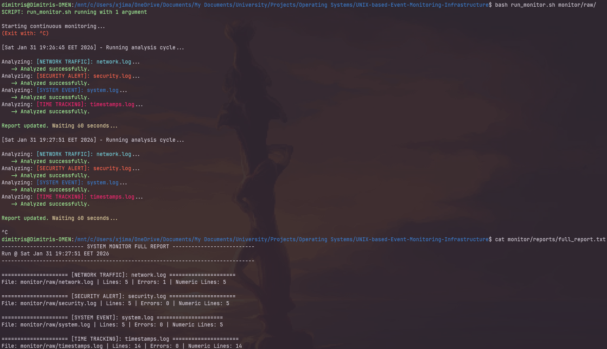
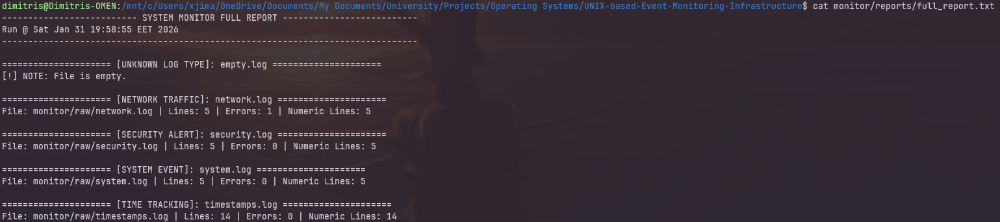
7. Usage of:
- [`for`](https://man.freebsd.org/cgi/man.cgi?for) (loop) every `$file` in the `$LOG_D` directory [`find()`](https://man.freebsd.org/cgi/man.cgi?find) all files that their `-name` contains "`.log`":
```bash
# Use 'find' to get all .log files and loop through them one by one
for file in $(find "$LOG_D" -name "*.log"); do
  # Categorization and executable
done
```
- Defining a `$filename` variable holding just the [`basename`](https://man.freebsd.org/cgi/man.cgi?basename) of the `$file` value (for ease) and then using [`case`](https://man.freebsd.org/cgi/man.cgi?case) (for categorization) to assign a string `$CATEGORY` and a string `$COLOR` (only used for [`echo`](https://man.freebsd.org/cgi/man.cgi?echo)-ing) depending on the `$filename`.
If `$filename="system.log"` then `$CATEGORY="[SYSTEM EVENT]"`, if `$filename="network.log"` then `$CATEGORY="[NETWORK TRAFFIC]"`, if `$filename="security.log"` then `$CATEGORY="[SECURITY ALERT]"`, if `$filename="timestamps.log"` then `$CATEGORY="[TIME TRACKING]"`, else `$filename="*.log"` then `$CATEGORY="[UNKNOWN LOG TYPE]"`:
```bash
# Extract filename from full path
filename=$(basename "$file")

# Check filename pattern to assign category label and add color
case "$filename" in
    system.log)
        CATEGORY="[SYSTEM EVENT]"
        COLOR=$BLUE
        ;;
    network.log)
        CATEGORY="[NETWORK TRAFFIC]"
        COLOR=$CYAN
        ;;
    security.log)
        CATEGORY="[SECURITY ALERT]"
        COLOR=$RED
        ;;
    timestamps.log)
        CATEGORY="[TIME TRACKING]"
        COLOR=$MAGENTA
        ;;
    *)
        CATEGORY="[UNKNOWN LOG TYPE]" # Default case
        COLOR=$YELLOW
        ;;
esac
```
- `while` loop for iterative execution that when `true` (always `true` until interrupted with the "signal interrupted" `SIGINT` signal (^C)) it executes the script's main code (with [`do`](https://man.freebsd.org/cgi/man.cgi?do)) and after it's finished it waits for `60` seconds to run again ([`sleep`](https://man.freebsd.org/cgi/man.cgi?sleep) `60`):
```bash
# Start infinite loop (iterative execution)
while true; do
    # Main script code
    # Pause script for 60" before starting next loop
    sleep 60
done
```

- Define `$OLD_IFS` variable to save the current IFS (Internal Field Separator):
```bash
# Save current IFS for later restoration
OLD_IFS=$IFS
```
Then set `$IFS` to "new line" `'\n'`, so that files with spaces in their `$filename` aren't divided to seperate files when passed to [`find()`](https://man.freebsd.org/cgi/man.cgi?find). (For example, a file named `"system alerts.log"` with the `$OLD_IFS` would be divided to two files: `"system"` and `"alerts.log"`. With `IFS=$'\n'`, `"system alerts.log"` would be passed to [`find()`](https://man.freebsd.org/cgi/man.cgi?find).):
```bash
# Set IFS to "new line" for filenames w/ spaces to be handled correctly
IFS=$'\n'
```
Finally, after the [`for`](https://man.freebsd.org/cgi/man.cgi?for) loop is [`done`](https://man.freebsd.org/cgi/man.cgi?done) restore the `IFS`'s original value by re-assigning its original value (`$OLD_IFS`):
```bash
# Restore original IFS
IFS=$OLD_IFS
```

*Note: The enable escape characters `-e` flag in [`echo`](https://man.freebsd.org/cgi/man.cgi?echo) is used for a <span style="color:red"> *colored output*</span>. Only [`bash`](https://man.freebsd.org/cgi/man.cgi?bash) recognizes that flag, [`sh`](https://man.freebsd.org/cgi/man.cgi?sh) acts as if it's part of the output.*

---

## VII. Threads for parallel log analysis